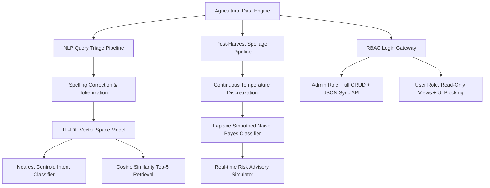

# 🌾 KoolKisaan: Intelligent Farmer Query Classifier, Semantic Retrieval & Post-Harvest Spoilage Advisory System

[](https://iitrpr.ac.in)
[](https://iitrpr.ac.in)
[](#architecture)
[](#methodology)
[](LICENSE)

> An offline-first, client-side Artificial Intelligence decision-support portal built to triage natural language farmer queries, auto-draft expert answers using semantic similarity, diagnose post-harvest storage risks, and enforce enterprise Role-Based Access Control (RBAC).

---

## 📋 Table of Contents

- [Overview](#-overview)
- [Key Features](#-key-features)
- [System Architecture](#-system-architecture)
- [Machine Learning & NLP Methodology](#-machine-learning--nlp-methodology)
- [Dataset Specifications](#-dataset-specifications)
- [Project Structure](#-project-structure)
- [Quick Start & Installation](#-quick-start--installation)
- [Default User Credentials](#-default-user-credentials)
- [API & Persistence Layer](#-api--persistence-layer)
- [Screenshots & UI Experience](#-screenshots--ui-experience)
- [Course & Institutional Credits](#-course--institutional-credits)

---

## 🌟 Overview

Agriculture employs over 50% of the active workforce in developing regions. Farmers routinely encounter severe challenges ranging from crop pests and fluctuating market prices to catastrophic post-harvest decay. Digital helpdesks receive thousands of unstructured queries daily, where manual triaging causes critical delays.

**KoolKisaan** solves these challenges directly in the browser through high-performance client-side AI:
1. **Automated Triage**: Classifies raw natural language questions into domain intents (*Market Rates, Plant Protection, Government Schemes, Weather, Nutrient Management, Seeds*).
2. **Semantic Similarity Retrieval**: Discovers the top 5 most relevant historical queries from a 2,000+ case repository with phonetic spell correction to auto-draft expert guidance.
3. **Post-Harvest Risk Simulation**: Employs a Laplace-smoothed Bayesian model to compute real-time decay probability based on microclimate variables (temperature, crop physiology, storage conditions).
4. **Data Security (RBAC)**: Protects core agricultural databases with role-based segregation between standard helpdesk operators and system administrators.

---

## 🚀 Key Features

### 1. 🤖 Client-Side NLP Intent Classification
* **TF-IDF Centroid Engine**: Vectorizes incoming queries in real time and classifies them against class centroid vectors.
* **Typo & Colloquial Normalization**: Auto-corrects common phonetic spelling errors and agricultural abbreviations (e.g., `ourea` $\rightarrow$ `urea`, `subsdy` $\rightarrow$ `subsidy`, `mandi` $\rightarrow$ `market`).
* **Instant Confidence Scores**: Displays ranked intent breakdown with percentage probabilities.

### 2. 🔍 Semantic FAQ & Knowledge Retrieval
* **Vector Cosine Similarity**: Scans 2,000 historical farmer cases in $< 5\text{ ms}$ with zero cloud dependencies.
* **Top-5 Ranked Matches**: Pulls the most relevant resolved queries with state, crop, and date annotations to accelerate helpdesk resolution.

### 3. 🌡️ Post-Harvest Spoilage Risk Advisor
* **Bayesian Risk Prediction**: Uses discrete temperature binning and categorical conditional probabilities to forecast crop spoilage probability.
* **Interactive Risk Simulator**: Adjust crop type (Onion, Tomato, Maize, Potato, Wheat), village microclimate, continuous temperature sliders, and storage structure type (closed facility vs. open-air heaps) with instant visual risk badges (**SAFE**, **MODERATE**, **CRITICAL**).
* **Storage Diagnostics**: Explains microclimate risks (e.g., why unventilated closed storage causes heat traps and 69.6% onion rot).

### 4. 🔒 Role-Based Access Control (RBAC) & CRUD Portal
* **Role Hierarchy**:
  * **Administrator** (`admin`): Full read/write permissions, record creation, editing, deletion, and local database sync.
  * **Standard User** (`user`): Read-only dashboards and query tools; management controls and edit buttons are securely hidden.
* **State Persistence**: Secure `sessionStorage` session management with unauthorized route guards and visual warnings.

### 5. 📊 Interactive Visual Telemetry
* **Dynamic Chart.js Visualizations**: Real-time intent distributions, seasonal crop trends, temperature-decay correlations, and state-wise query heatmaps.

---

## 🏗️ System Architecture



---

## 🔬 Machine Learning & NLP Methodology

### 1. TF-IDF Vectorization & Nearest Centroid Classification
Vocabulary term weights are calculated using smoothed inverse document frequencies:
$$\text{TF-IDF}(w, d) = \text{TF}(w, d) \times \ln\left(1 + \frac{N}{\text{DF}(w)}\right)$$

Query-to-class similarity is evaluated against category centroid vectors $\vec{c}_k$:
$$\text{Cosine Similarity}(\vec{q}, \vec{c}_k) = \frac{\vec{q} \cdot \vec{c}_k}{\|\vec{q}\| \|\vec{c}_k\|}$$

### 2. Laplace-Smoothed Naive Bayes Spoilage Estimator
The posterior probability of crop spoilage given ambient features $\vec{x} = \{\text{Crop}, \text{Location}, \text{TempBin}, \text{Storage}\}$:
$$P(\text{Spoilage} \mid \vec{x}) \propto P(\text{Spoilage}) \prod_{i=1}^n P(x_i \mid \text{Spoilage})$$

With Laplace correction ($a = 1$) to prevent zero-frequency estimation errors:
$$P(x_i \mid \text{Spoilage}) = \frac{\text{Count}(x_i \cap \text{Spoilage}) + 1}{\text{Count}(\text{Spoilage}) + V_i}$$
where $V_i$ denotes the number of distinct values for feature $i$.

---

## 📊 Dataset Specifications

| Dataset | Records | Features | Description |
| :--- | :---: | :--- | :--- |
| **Raksha Farmer Queries** | **2,000** | `QueryText`, `QueryType`, `StateName`, `DistrictName`, `Season`, `year`, `month` | Unstructured farmer helpline queries spanning 5 major agricultural states (UP, Karnataka, Telangana, MP, Maharashtra). |
| **Post-Harvest Spoilage Dataset** | **100** | `Record_ID`, `Crop`, `Location`, `Temp`, `Storage`, `Spoilage` | Empirical post-harvest storage histories capturing temperature, shelter conditions, and decay outcomes across 5 staple crops. |

---

## 📁 Project Structure

```bash
iitr/
├── index.html                  # Single Page Application UI & dashboard views
├── styles.css                  # Lush Greenery glassmorphism styling & animations
├── app.js                      # UI state manager, Naive Bayes logic, RBAC handlers
├── retriever.js                # In-memory TF-IDF vectorizer, spell checker, centroid engine
├── chart.js                    # Local standalone Chart.js v4 bundle
├── run_server.py               # Lightweight Python HTTP server & database sync daemon
├── prepare_data.py             # Data preparation & pre-compiled JSON/JS generator
├── update_spoilage_json.py     # Spoilage database update & utility scripts
├── project_report.md           # Academic project documentation & report
├── data/
│   ├── data.js                 # Pre-compiled global dataset for instant offline loading
│   ├── queries.json            # 2,000 processed farmer queries
│   ├── spoilage.json           # 100 post-harvest storage records
│   ├── risk_data.json          # Pre-computed conditional frequency tables
│   └── stats.json              # Aggregated diagnostic distributions
├── agri_ai_advisory_risk_dataset.csv  # Raw tabular advisory dataset
└── raksha-farmer-query.csv            # Raw farmer queries dataset
```

---

## ⚡ Quick Start & Installation

### Prerequisites
* **Python 3.8+** (for serving and data preparation)
* Any modern web browser (Chrome, Edge, Firefox, Safari)

### 1. Clone the Repository
```bash
git clone https://github.com/nadawaris/KoolKisaan.git
cd KoolKisaan
```

### 2. (Optional) Rebuild Datasets
If you modify the source CSVs, re-generate the pre-compiled JS/JSON databases:
```bash
python prepare_data.py
```

### 3. Launch Local Server
Start the built-in HTTP server with database synchronization support:
```bash
python run_server.py
```

### 4. Open in Browser
Navigate to:
```text
http://localhost:8000
```
*(Or simply open `index.html` directly in your browser for offline client-side functionality!)*

---

## 🔑 Default User Credentials

KoolKisaan implements Role-Based Access Control (RBAC). Use the following credentials to authenticate:

| Role | Username | Password | Permissions |
| :--- | :--- | :--- | :--- |
| **Administrator** | `admin` | `admin123` | Full Access: Query classification, spoilage simulator, interactive charts, and full **CRUD Database Management** with server synchronization. |
| **Standard User** | `user` | `user123` | Read-Only Access: Query classifier, semantic search, and simulator. Management controls and edit buttons are hidden. |

---

## 📡 API & Persistence Layer

When running `run_server.py`, KoolKisaan exposes a local persistence endpoint:

* **Endpoint**: `POST /api/sync`
* **Content-Type**: `application/json`
* **Payload**:
  ```json
  {
    "type": "spoilage",
    "data": [ ... ]
  }
  ```
* **Behavior**: Writes the updated dataset directly to `data/spoilage.json` and updates `data/data.js` automatically.

---

## 🎓 Course & Institutional Credits

* **Course**: *Fundamentals of AI Using Agriculture Data Set* (1-Credit Course / 30 Hours)
* **Center of Excellence**: **ANNAM.AI** – Centre of Excellence, Ministry of Education, Government of India
* **Host Institution**: **Indian Institute of Technology Ropar (IIT Ropar)**
* **Year**: 2026

---

## 📄 License

This project is licensed under the **MIT License** — feel free to use and adapt it for academic and research purposes.
