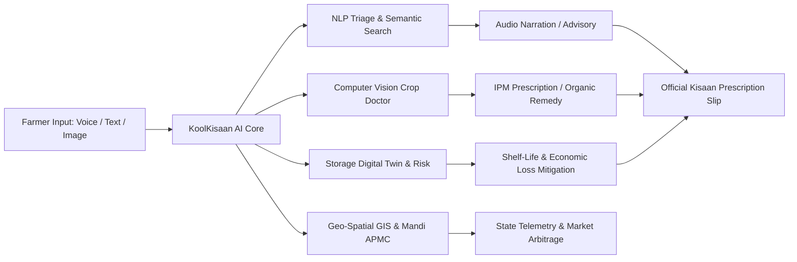

# 🌾 KoolKisaan Pro: Precision AI Farmer Advisory, Computer Vision Diagnostics & Post-Harvest Digital Twin

[](https://iitrpr.ac.in)
[](https://iitrpr.ac.in)
[](#architecture)
[](#methodology)
[-teal.svg)](#key-features)
[](LICENSE)

> An offline-first, client-side Artificial Intelligence precision agriculture suite built to triage natural language farmer queries, auto-draft expert answers using semantic similarity, diagnose foliar diseases using computer vision simulation, predict post-harvest shelf life with physics-based digital twins, provide geo-spatial market intelligence, and enforce enterprise Role-Based Access Control (RBAC).

---

## 📋 Table of Contents

- [Overview](#-overview)
- [Key Features & Pro Capabilities](#-key-features--pro-capabilities)
- [System Architecture](#-system-architecture)
- [Machine Learning & NLP Methodology](#-machine-learning--nlp-methodology)
- [Module Breakdown](#-module-breakdown)
  - [Task 1: Telemetry & Spoilage Analytics](#task-1-telemetry--spoilage-analytics)
  - [Task 2: NLP Query Intent Classifier](#task-2-nlp-query-intent-classifier)
  - [Task 3: Semantic FAQ Retrieval & Advisory](#task-3-semantic-faq-retrieval--advisory)
  - [Task 4: AI Crop Doctor (Vision Diagnostics)](#task-4-ai-crop-doctor-vision-diagnostics)
  - [Task 5: Post-Harvest Storage Digital Twin](#task-5-post-harvest-storage-digital-twin)
  - [Task 6: Geo-Spatial GIS Map & Mandi APMC](#task-6-geo-spatial-gis-map--mandi-apmc)
- [Dataset Specifications](#-dataset-specifications)
- [Project Structure](#-project-structure)
- [Quick Start & Installation](#-quick-start--installation)
- [Default User Credentials](#-default-user-credentials)
- [Course & Institutional Credits](#-course--institutional-credits)
- [License](#-license)

---

## 🌟 Overview

Agriculture employs over 50% of the active workforce in developing regions. Farmers routinely encounter severe challenges ranging from crop pests and fluctuating market prices to catastrophic post-harvest decay. Digital helpdesks receive thousands of unstructured queries daily, where manual triaging causes critical delays.

**KoolKisaan Pro** transforms agricultural decision support directly in the browser through high-performance client-side AI:
1. **Automated NLP Triage**: Classifies raw natural language questions into domain intents (*Market Rates, Plant Protection, Government Schemes, Weather, Nutrient Management, Seeds*).
2. **Multilingual Voice AI**: Hands-free voice speech-to-text (STT) and text-to-speech (TTS) advisory narrator supporting 7 regional languages (*Hindi, Punjabi, Marathi, Telugu, Bengali, Gujarati, Indian English*).
3. **Computer Vision Crop Doctor**: Leaf disease visual scanner with bounding boxes, foliar severity estimation, and dual-track organic/chemical IPM prescriptions.
4. **Post-Harvest Storage Digital Twin**: Multi-factor microclimate physics simulator computing remaining shelf life (hours/days), decay probability, and financial Value-at-Risk ($ / ₹).
5. **Geo-Spatial GIS Map & Mandi APMC Ticker**: Live state query heatmaps, weather hazard alerts, and regional commodity arbitrage monitoring.
6. **Digital Kisaan Prescription Generator**: 1-click printable / WhatsApp shareable advisory slips with IIT Ropar ANNAM.AI digital verification.
7. **Data Security (RBAC) & CRUD**: Role-based access control segregating standard operators and administrators with disk persistence.

---

## 🚀 Key Features & Pro Capabilities



### 1. 🎙️ Multilingual Voice AI Engine (`voice_assistant.js`)
* **Real-Time Speech Recognition (STT)**: Direct microphone dictation with visual soundwave animation.
* **Text-to-Speech (TTS) Narrator**: Reads out intent classifications, draft advisories, and pathology recipes for low-literacy rural users.
* **Language Switcher**: Dynamic locale switching across 7 regional dialects.

### 2. 🔬 AI Crop Doctor: Vision Diagnostics (`crop_doctor.js`)
* **Interactive Canvas Scanner**: Simulated CNN detection with animated laser scanning viewport.
* **Pathogen Detection & Bounding Boxes**: Identifies foliar diseases (*Tomato Early Blight, Wheat Yellow Rust, Onion Purple Blotch, Paddy Bacterial Blight, Healthy Citrus*).
* **Dual IPM Prescriptions**: Bio-control remedies (Neem seed kernel extract, Trichoderma) alongside chemical fungicide dosages (g/L, PHI).

### 3. 🌡️ Storage Digital Twin & Financial Loss Forecaster (`digital_twin.js`)
* **Multi-Variable Physics Simulation**: Integrates temperature (5–45°C), relative humidity (20–95%), aeration (unventilated, natural louvers, forced cold air), packaging (jute, plastic crates, cold room CA), and storage days.
* **Safe Shelf-Life Countdown**: Real-time prediction of safe storage hours and days remaining.
* **Financial Value-at-Risk Matrix**: Calculates total lot value, estimated spoilage loss (₹), and potential savings through facility upgrades.

### 4. 🗺️ Geo-Spatial GIS Map & Mandi Market Intelligence (`geo_map.js`)
* **Interactive SVG India Map**: Pulsing state hotspots (UP, Maharashtra, Karnataka, MP, Telangana, Punjab) displaying live query volumes and pest warnings.
* **Continuous Mandi Marquee Ticker**: Real-time commodity benchmark rates across top APMC mandis (Lasalgaon, Kolar, Khanna, Indore, Agra, Hubli, Warangal).

### 5. 📄 Digital Kisaan Prescription Generator
* **Official Advisory Slip**: Branded IIT Ropar ANNAM.AI Center of Excellence prescription modal with digital QR integrity, print-ready CSS formatting, and 1-click WhatsApp sharing.

---

## 🔬 Machine Learning & NLP Methodology

### 1. TF-IDF Vectorization & Nearest Centroid Classification
Vocabulary term weights are calculated using smoothed inverse document frequencies:
$$\text{TF-IDF}(w, d) = \text{TF}(w, d) \times \ln\left(1 + \frac{N}{\text{DF}(w)}\right)$$

Query-to-class similarity is evaluated against category centroid vectors $\vec{c}_k$:
$$\text{Cosine Similarity}(\vec{q}, \vec{c}_k) = \frac{\vec{q} \cdot \vec{c}_k}{\|\vec{q}\| \|\vec{c}_k\|}$$

### 2. Laplace-Smoothed Bayesian Spoilage Estimator
The posterior probability of crop decay given ambient features $\vec{x} = \{\text{Crop}, \text{Location}, \text{TempBin}, \text{Storage}\}$:
$$P(\text{Spoilage} \mid \vec{x}) \propto P(\text{Spoilage}) \prod_{i=1}^n P(x_i \mid \text{Spoilage})$$

With Laplace correction ($a = 1$) to prevent zero-frequency estimation errors:
$$P(x_i \mid \text{Spoilage}) = \frac{\text{Count}(x_i \cap \text{Spoilage}) + 1}{\text{Count}(\text{Spoilage}) + V_i}$$

---

## 📁 Project Structure

```bash
iitr/
├── index.html                  # Single Page Application UI & Pro dashboard views
├── styles.css                  # Lush Greenery & Dark Carbon Forest design system
├── app.js                      # Central state manager, event router & RBAC guards
├── retriever.js                # In-memory TF-IDF vectorizer, spell checker, centroid engine
├── voice_assistant.js          # Web Speech STT/TTS engine across regional Indian languages
├── crop_doctor.js              # Vision diagnostic simulator, canvas renderer & IPM recipes
├── digital_twin.js             # Microclimate physics, shelf-life decay & loss forecaster
├── geo_map.js                  # Interactive SVG GIS agricultural map & live Mandi ticker
├── chart.js                    # Local standalone Chart.js v4 bundle
├── run_server.py               # Lightweight Python HTTP server & database sync daemon
├── prepare_data.py             # Data preparation & pre-compiled JSON/JS generator
├── data/
│   ├── data.js                 # Pre-compiled global dataset for instant offline loading
│   ├── queries.json            # 2,000 processed farmer queries
│   ├── spoilage.json           # 100 post-harvest storage records
│   ├── risk_data.json          # Pre-computed conditional frequency tables
│   └── stats.json              # Aggregated diagnostic distributions
├── faq/                        # Full-stack Community QA & automated answer pipeline
├── agri_ai_advisory_risk_dataset.csv  # Raw tabular advisory dataset
└── raksha-farmer-query.csv            # Raw farmer queries dataset
```

---

## ⚡ Quick Start & Installation

### Prerequisites
* **Python 3.8+** (for serving and data persistence)
* Any modern web browser (Chrome, Edge, Firefox, Safari)

### 1. Run the Local Server
```bash
python run_server.py
```

### 2. Open in Browser
Navigate to `http://localhost:8000` in your web browser.

---

## 🔐 Default User Credentials

| Role | Username | Password | Privileges |
| :--- | :--- | :--- | :--- |
| **Administrator** | `admin` | `admin123` | Full CRUD access, dataset creation, editing, deletion & local disk sync |
| **Standard User** | `user` | `user123` | Read-only access to all AI dashboards, simulators, voice, vision, and telemetry |

---

## 🏛️ Course & Institutional Credits

* **Course**: *Fundamentals of AI Using Agri Dataset*
* **Center of Excellence**: **ANNAM.AI CoE, IIT Ropar**
* **Institution**: Indian Institute of Technology Ropar (IIT Ropar)

---

## 📄 License

This project is licensed under the MIT License.
