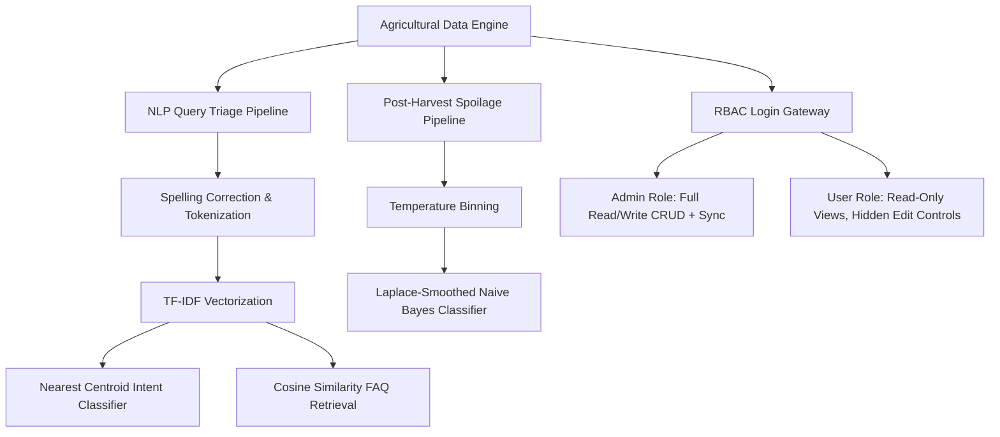

# Title: KoolKisaan: An Intelligent Farmer Query Classifier, Semantic Retrieval, and Post-Harvest Spoilage Advisory System with Role-Based Access Control


### Application Context
Agriculture forms the backbone of the socio-economic structure in developing regions, employing more than 50% of the active workforce. Despite its significance, farmers operate in a highly volatile environment characterized by unpredictable weather events, crop diseases, post-harvest losses, and lack of direct market transparency. To bridge this information gap, digital portals and tele-advisories receive thousands of unstructured natural language queries daily. Triaging these questions manually creates significant operational delays, preventing timely interventions that save crops from failure.

Furthermore, post-harvest losses due to rotting and decay remain a major issue. Farmers lack quantitative tools to understand how storage microclimates (temperature, ventilation, and storage structure type) impact decay rates across different crops. Consequently, high-risk shipments decay before reaching mandis, leading to severe economic losses.

### Motivation
By applying artificial intelligence client-side, we can turn raw historical data into instant agricultural recommendations. Automating query categorization and similarity-based retrieval allows helpline portals to auto-draft high-quality responses based on past validated expert answers. Concurrently, by training a machine learning classifier on post-harvest storage histories, we can deploy a proactive risk simulator to warn farmers of high-decay conditions. 

Lastly, to protect the integrity of these critical datasets, agricultural portals require robust security. Implementing Role-Based Access Control (RBAC) ensures that standard helpdesk operators (Standard Users) can search and view records, while database modifications (CRUD operations) and synchronization are restricted to supervisors (Administrators).

---

## 2. Problem Statement

This project implements an intelligent, offline-first agricultural decision support portal (**KoolKisaan**) to address the following challenges:

1. **Natural Language Query Triage (NLP)**:
   * **Intent Classification**: Predict query categories (*Market Rates & Info*, *Plant Protection*, *Nutrient Management*, *Government Schemes*, *Weather*, or *Seeds*) using a client-side TF-IDF Centroid model.
   * **Semantic FAQ Retrieval**: Retrieve the top 5 most semantically similar historical questions from a 2,000-query database to auto-draft expert answers.
   * **Linguistic Ambiguity & Spell-Correction**: Handle phonetic errors, colloquial abbreviations (e.g., `govt`, `subsdy`), and semantic conflicts (e.g., queries referencing both "seeds" and "subsidy").

2. **Post-Harvest Spoilage Risk Advisory (Predictive AI)**:
   * **Statistical Diagnostics**: Correlate crop type, continuous temperature ranges, and storage structures with crop decay rates.
   * **Risk Prediction**: Train a client-side Naive Bayes classifier with Laplace smoothing to predict spoilage risk in real time based on location, crop type, temperature, and storage access.

3. **Data Management & Access Security (RBAC & CRUD)**:
   * **Database Management**: Allow data curators to insert, update, search, and delete records from active databases.
   * **Role-Based Security**: Implement a secure login portal supporting Admin (`admin`/`admin123`) and User (`user`/`user123`) accounts. Hide data modification controls for standard users, intercept programmatic edits, and redirect unauthorized views.

---

## 3. Dataset Understanding

We analyze and integrate two primary datasets:

### 1. Raksha Farmer Query Dataset (NLP Module)
* **Size**: 2,000 records.
* **Geographical Distribution**: Uttar Pradesh (424), Karnataka (408), Telangana (397), Madhya Pradesh (388), and Maharashtra (383).
* **Key Fields**:
  * `QueryText` (String): Raw, unstructured farmer question (e.g., *"How can I control yellow mosaic virus on soybean?"*).
  * `QueryType` (String): Ground truth intent category.
  * `Location` (`StateName`, `DistrictName`, `BlockName`).
  * `Temporal` (`month`, `year`, `Season`).
* **Feature Engineering**: Standardized crop labels were missing in the original database. We wrote a regular expression (regex) parser to scan `QueryText` and extract the target crop, successfully identifying 28 crop types (e.g., Onion, Wheat, Citrus, Potato, Tomato, Cotton).

### 2. Post-Harvest Crop Spoilage Dataset (Predictive Module)
* **Size**: 100 entries.
* **Key Fields**:
  * `Record_ID` (Integer): Unique primary key.
  * `Crop` (Categorical): Onion, Tomato, Maize, Potato, Wheat.
  * `Location` (Categorical): Village A, Village B, Village C.
  * `Temp` (Numeric): Continuous temperature reading in °C.
  * `Storage` (Binary): Yes (Closed storage warehouse) / No (Open-air heaps).
  * `Spoilage` (Binary Target): Yes (Rotten) / No (Fresh).

---

## 4. Methodology

The KoolKisaan software pipeline consists of three core components:



### 1. Natural Language Processing (NLP)
* **Tokenization & Normalization**: Raw text is split into terms, converted to lowercase, and stripped of punctuation. Common conversational terms (stopwords like *please, farmer, question, query*) are removed. A dictionary-based normalizer resolves spelling errors (e.g., `ourea` -> `urea`, `subsdy` -> `subsidy`, `govt` -> `government`).
* **TF-IDF Vector Space Model**: Vocabulary term weights are computed as:
  $$\text{TF-IDF}(w, d) = \text{TF}(w, d) \times \ln\left(1 + \frac{N}{\text{DF}(w)}\right)$$
* **Nearest Centroid Classification**: We calculate the average vector (centroid) of documents belonging to each category. A query vector is assigned to the category of the closest centroid using **Cosine Similarity**:
  $$\text{Cosine Similarity}(\vec{q}, \vec{c}) = \frac{\vec{q} \cdot \vec{c}}{\|\vec{q}\| \|\vec{c}\|}$$

### 2. Spoilage Prediction (Naive Bayes)
* **Continuous Feature Discretization**: Continuous temperature values are categorized into discrete bins ($<25^\circ\text{C}$, $25^\circ\text{C}-30^\circ\text{C}$, $30^\circ\text{C}-35^\circ\text{C}$, $>35^\circ\text{C}$).
* **Bayesian Probability Inference**: The posterior probability of crop spoilage is calculated using Laplace smoothing ($a=1$):
  $$P(\text{Spoilage} \mid \vec{x}) \propto P(\text{Spoilage}) \prod_{i=1}^n P(x_i \mid \text{Spoilage})$$
  $$P(x_i \mid \text{Spoilage}) = \frac{\text{Count}(x_i \cap \text{Spoilage}) + 1}{\text{Count}(\text{Spoilage}) + V_i}$$
  Where $V_i$ represents the number of unique values for feature $i$.

### 3. Role-Based Access Control (RBAC)
* **Authentication**: Credentials verification inside `sessionStorage` (admin/admin123 &rarr; Administrator; user/user123 &rarr; Standard User).
* **UI Toggling & Blocking**: Hiding CRUD buttons and navigation options from Standard Users, with auto-redirection triggers and console blockers.

---

## 5. Implementation Details

We implemented **KoolKisaan** as a single-page application (SPA) designed to function entirely offline, removing network latency and external dependencies.

### Technical Stack
* **Language Compilers**: Python (v3.x) preprocesses raw CSV files, extracts crop focus via regex patterns, compiles statistics, and generates pre-compiled Javascript global databases (`data/data.js`).
* **Visuals & Charts**: Local copy of `chart.js` (v4.x) renders intent distributions, seasonal line charts, and spoilage correlation metrics on HTML5 canvases.
* **Application Core**: `retriever.js` contains the TF-IDF engine, similarity retrieval functions, and spelling corrector. `app.js` handles interactive sliders, state updates, Naive Bayes logic, login verification, and DOM updates.
* **Styling**: Structured stylesheet (`styles.css`) styled on a *Lush Greenery* theme with custom glassmorphism overlays, interactive hover feedback, and responsive layouts.
* **Server Daemon**: `run_server.py` is a custom Python HTTP request handler serving files locally on port 8000 and supporting POST requests to `/api/sync` to write updates directly to the local database.

---

## 6. Results and Discussions

### 1. Farmer Query Intent Distributions
Visualizations of the 2,000 Raksha queries reveal query counts are balanced across classes:
* **Market Rates & Info**: 357 queries (17.9%) — *Primary Concern*
* **Plant Protection**: 348 queries (17.4%)
* **Government Schemes**: 334 queries (16.7%)
* **Weather**: 334 queries (16.7%)
* **Nutrient Management**: 323 queries (16.2%)
* **Seeds**: 304 queries (15.2%)

#### Agricultural Interpretations
The prevalence of *Market Rates & Info* and *Plant Protection* implies that the immediate survival of farming operations relies heavily on price discovery and pest/disease management. Temporally, query volumes spike in **January** (768) and **February** (695), aligning with winter crop (Rabi) harvest logistics and Kharif planning cycles.

### 2. Crop Spoilage Diagnostic Insights
Analysis of the 100 crop storage records yielded three critical agricultural insights:

#### Spoilage Rate by Crop Type
* **Onion**: **69.6% Spoilage Rate** (16/23 spoiled) — *Highest risk. Onion bulb cells have high moisture content and continue respiring post-harvest, generating local heat.*
* **Tomato**: **53.3%** (8/15 spoiled)
* **Maize**: **52.2%** (12/23 spoiled)
* **Potato**: **47.6%** (10/21 spoiled)
* **Wheat**: **44.4%** (8/18 spoiled) — *Lowest risk due to low grain moisture content.*

#### Temperature Impact
* Spoilage rates peak at **60.7%** inside the **30°C – 35°C** temperature range, representing the optimal climate for fungal growth and bacteria reproduction.
* In extreme hot conditions ($&gt;35^\circ\text{C}$), the spoilage rate drops to **43.5%** because high dry heat rapidly dehydrates crop tissue before moisture-driven wet rot can establish.

#### Storage Environment Impact
* **Closed Storage Facility**: **57.1% Spoilage** (28/49 cases)
* **Open-Air Heaps**: **51.0% Spoilage** (26/51 cases)
* *Discussion:* Closed storage without active ventilation traps heat and relative humidity from crop respiration, creating a mold-breeding microclimate. Proper ventilation is more crucial than simple coverage.

### 3. Model Performance & Security Access
* **Naive Bayes Spoilage Classifier**: Achieved a baseline training accuracy of **64.0%**, accurately identifying high-risk combinations (e.g., Tomato in hot storage).
* **TF-IDF Vocabulary Correction**: Effectively resolved linguistic ambiguities. In the query *"What is the government subsidy available for purchasing wheat seeds?"*, the rare term *"subsidy"* (IDF 3.2) correctly pulls the classification vector toward **Government Schemes** instead of **Seeds** (IDF 2.1).
* **RBAC Enforcement**: The portal successfully hides CRUD controls, blocks unauthorized URL/tab clicks, and forces auto-redirection to Task 1 for standard users, guaranteeing data integrity.

---

## 7. Conclusion

The **KoolKisaan** agricultural portal successfully demonstrates the integration of client-side natural language processing (NLP), Bayesian machine learning, and access control (RBAC) to support agricultural advisory tasks. The statistical and predictive results suggest that post-harvest decay is heavily influenced by high warehouse humidity and specific temperature windows, highlighting the absolute necessity of active ventilation in crop storage. 

By running all classifiers and vector retrievals locally in the browser, the application provides helpdesk agents with instant intent prediction, similarity query FAQ auto-drafting, and post-harvest risk advisory without any external internet connection or server delays.

---

## 8. References

1. **Raksha Case Study Dataset - Case 02**, IIT Ropar ANNAM.AI learning materials (2026).
2. **Crop Spoilage Data Set**, Post-Harvest Storage Case Studies, IIT Ropar (2026).
3. **Scikit-learn Documentation**, Naive Bayes Classifier and TF-IDF Vectorization formulas.
4. **Chart.js Documentation (v4.x)**, HTML5 Canvas Charting library.
5. **Python Software Foundation**, Standard documentation for standard libraries (`csv`, `json`, `re`, `http.server`).

---

## 9. Appendix

### Appendix A: Spoilage Classifier & Naive Bayes Predictor (app.js snippet)
```javascript
// Naive Bayes Crop Spoilage Classifier
function predictNaiveBayes(crop, loc, temp, store) {
    const temp_bin = temp > 30 ? "High" : "Low";
    const spStats = statsData.spoilage_stats || {};
    const class_counts = spStats.class_counts || { "Yes": 0, "No": 0 };
    const conds = spStats.conditional_counts || {
        "Yes": { "crop": {}, "location": {}, "temp_bin": {}, "storage": {} },
        "No":  { "crop": {}, "location": {}, "temp_bin": {}, "storage": {} }
    };

    const spoil_count = class_counts["Yes"];
    const fresh_count = class_counts["No"];
    const total_count = spoil_count + fresh_count;

    if (total_count === 0) return { risk: "SAFE", probability: 0 };

    const p_spoil = spoil_count / total_count;
    const p_fresh = fresh_count / total_count;

    const get_cond_prob = (lbl, feature, val, vocab_size) => {
        const matches = conds[lbl][feature][val] || 0;
        const total_lbl = lbl === "Yes" ? spoil_count : fresh_count;
        return (matches + 1) / (total_lbl + vocab_size);
    };

    // Probabilities under Yes (Spoiled)
    const p_crop_spoil = get_cond_prob("Yes", "crop", crop, 5);
    const p_loc_spoil = get_cond_prob("Yes", "location", loc, 3);
    const p_temp_spoil = get_cond_prob("Yes", "temp_bin", temp_bin, 2);
    const p_store_spoil = get_cond_prob("Yes", "storage", store, 2);
    const score_spoil = p_spoil * p_crop_spoil * p_loc_spoil * p_temp_spoil * p_store_spoil;

    // Probabilities under No (Fresh)
    const p_crop_fresh = get_cond_prob("No", "crop", crop, 5);
    const p_loc_fresh = get_cond_prob("No", "location", loc, 3);
    const p_temp_fresh = get_cond_prob("No", "temp_bin", temp_bin, 2);
    const p_store_fresh = get_cond_prob("No", "storage", store, 2);
    const score_fresh = p_fresh * p_crop_fresh * p_loc_fresh * p_temp_fresh * p_store_fresh;

    // Normalize
    const prob_spoil = score_spoil / (score_spoil + score_fresh);
    return Math.round(prob_spoil * 100);
}
```

### Appendix B: Role-Based Tab Switch Interceptor (app.js snippet)
```javascript
// Block non-admin navigation to CRUD tab
navItems.forEach(item => {
    item.addEventListener('click', () => {
        const targetTab = item.getAttribute('data-tab');
        
        if (targetTab === 'crud') {
            const role = sessionStorage.getItem('koolkisaan_role') || 'user';
            if (role !== 'admin') {
                alert("Access denied. Only Administrators can manage datasets.");
                return;
            }
        }
        // ... (Activate tab pane and transition view)
    });
});
```
